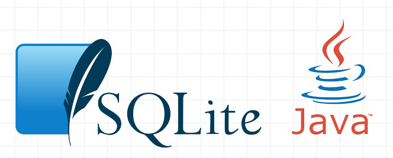
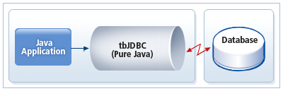
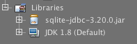

## ¿Que es SQLite?

SQLite es un sistema de gestión de bases de datos relacional, contenida en una relativamente pequeña biblioteca escrita en C. Como ya se menciono anteriormente en la presentación la principal ventaja de este motor de base de datos es que no tenemos la necesidad de hacer uso de servidores locales o externos que gestiónan el contenido de esta.

Nuestra base de datos SQLite se gestiona en un archivo donde tenemos todos nuestros datos. Asi que simplemente con copiar este archivo en otra maquina tendremos acceso a nuestros datos, sin tener la necesidad de tener implantado un servidor de acceso a estos datos.

Asi que a continuacion iremos a desarollar una guia de como instalar nuestra base de datos, conectarnos, realizar consultas, y demas.

## ¿Que necesitamos para trabajar?

Antes de comenzar a trabajar con SQLite vamos a mencionar lo que debemos tener instalado en nuestra maquina, y explicar que funcion cumple cada uno de estos.

 - [**Netbeans IDE:**](https://netbeans.org/downloads/index.html) Como ya se sabe, Netbeans es un entorno de desarollo que nos facilita la ejecucion, depuracion, y escritura de nuestro codigo.
 - [**SQLite:**](https://www.sqlite.org/download.html) Es nuestro sistema de gestion de base de datos que mencionamos anteriormente.
 - [**JDBC (Java Database Conectivity):**](/download/sqlite-jdbc-3.20.0.jar.zip) Es una API que permite la ejecución de operaciones sobre nuestra base de datos desde Java, es la que ira a "hablar" con nuestra base de datos.

Para descargar estas herramientas simplemente basta hacer click encima del titulo de cada una, o en caso contrario hacer [click aqui](/download) para ver todos las descargas.

> **Aclaración:** Todas estas herramientas ya se encuentran instaladas en las maquinas del laboratorio que iremos a desarollar esta guia.

## ¿Como iremos a trabajar?



Como se puede ver en la imagen superior, la arquitectura sobre la cual estaremos trabajando, nuestra aplicacion **Java** intercambia mensajes con **JDBC**, y este le envia nuestros mensajes a nuestra base de datos **SQLite**.

Bueno, ahora que ya tenemos todas las herramientas necesarias y sabemos como funciona la arquitectura sobre la cual vamos a trabajar, nos ponemos manos a la obra y a trabajar :stuck_out_tongue_winking_eye:.

## Comienzo de la guia de trabajo

## ¿Que nos pidieron?
Una veterinaria muy popular de la ciudad la cual atiende muchos animales, entre ellos perros :dog: nos solicito que desarollemos una aplicacion.

 - **Guardar perrros:** Nos pidieron que guardemos cada perro que es atendido por ellos, de cada uno de ellos les interesa su numero de chip, su nombre, su raza.
  - **Listar perros:** Tambien nos solicitan que seamos capaces de mostrar todos los perros que se han guardado, mostrando cada uno de sus datos.
  - **Listar perros ordenados por raza:** Tambien les interesa tener la posibilidad de ver todos los perros ordenados por raza.
  
## Desarollando nuestra aplicación
### Creando nuestro proyecto
Para el desarollo de la aplicacion, nuestro primer paso sera crear un proyecto de consola en Netbeans.
1. Irnos a <kbd>File->New Proyect</kbd>.
2. Seleccionar Java Application y clickear <kbd>Next</kbd>.
3. Introducir el nombre de nuestro proyecto y la carpeta donde lo iremos a guardar y clickear <kbd>Finish</kbd>

### Creando nuestra clase Perro

Luego de crear el proyecto pasaremos a modelar nuestro problema, para ello tendremos que crear la clase **Perro**, ya sabemos que atributos tendra esta.
Nuestra clase quedara muy parecida a esta:

```Java
public class Perro {
    private int chip;
    private String nombre;
    private String raza;
    
    public int getChip() {
        return chip;
    }

    public void setChip(int unChip) {
        chip = unChip;
    }

    public String getNombre() {
        return nombre;
    }

    public void setNombre(String unNombre) {
        nombre = unNombre;
    }

    public String getRaza() {
        return raza;
    }

    public void setRaza(String unaRaza) {
        raza = unaRaza;
    }
    
    public Perro(int unChip, String unNombre, String unaRaza){
        setChip(unChip);
        setNombre(unNombre);
        setRaza(unaRaza);
    }
    
    @Override
    public String toString(){
        return "Chip: " + getChip() + " - Nombre: " + getNombre() + " - Raza: " + getRaza();
    }
}
```

### Importando la libreria JDBC
Como dijimos para que nuestra aplicacion Java se conecte con nuestra base de datos necesitamos importar la libreria JDBC que descargamos anteriormente, asi que antes de empezar con la sección de codigo donde nuestra aplicacion se conectara con la base de datos debemos realizar los siguientes pasos.

1. Crear directorio **"libs"** en la carpeta de nuestro proyecto.
2. Copiar el archivo **"sqlite-jdbc-[****].jar"** dentro del directorio que creamos.
3. Dentro del Netbeans con hacemos click derecho sobre Libraries clickeamos encima de **"Add JAR/Folder"**.
4. Seleccionamos nuestro archivo **"sqlite-jdbc-[****].jar"** que copiamos en nuestro directorio.



Listo :+1:, en nuestro proyecto deberia aparecer la libreria que acabamos de agregar como se muestra arriba.

### Creando nuestra clase Conexion
Ahora que ya tenemos la libreria JDBC importada, pasaremos a crear la clase **Conexion** ; esta clase sera la encargada de conectarse, desconectarse, asi como insertar y eliminar los perros a nuestra base de datos.

Lo primero que debemos definir de esta clase sera los atributos que tendremos en esta, vamos a tener un **String** que repesenta la ruta donde estara ubicada nuestra base de datos y un objeto **Connection** que va a ser el punto de entrada a nuestra base de datos.

```Java
public class Conexion {
    private String rutaArchivoBD;
    private Connection conexion;
    
    public Conexion(String unaRutaArchivoBD) throws SQLException{
        rutaArchivoBD = unaRutaArchivoBD;
    }
}
```

Ahora debemos agregar un metodo **conectar()** y un metodo **cerrar()**, estos se encargaran de abrir la conexion con la base de datos y cerrarla.

```Java
private void conectar() throws SQLException{
    conexion = DriverManager.getConnection("jdbc:sqlite:" + rutaArchivoBD);
}

private void cerrar() throws SQLException{
    conexion.close();   
}
```

> **Nota:** Como se puede observar el codigo esta sujeto a mejoras, ya que podriamos añadir un manejo de excepciones que no lo estamos haciendo.

Lo que hace el primer metodo es simplemente instanciar un objeto del tipo **Connection**, y para esto su constructor recibe como parametro el tipo de base de datos que estamos usando (en este caso SQLite), asi como la ruta de donde guardaremos esta base de datos. Y el segundo metodo simplemente cierra la conexion.
Con esto ya podriamos conectarnos a nuestra base de datos yeahh :smiley:.

### Creando nuestra Tabla Perros

Falta una cosa :disappointed: para guardar nuestros perros necesitamos tener una estructura que se llama Tabla. Esto es simplemente una tabla como el nombre lo indica donde cada fila de esta tabla representa un perro especifico, y cada columna representa los datos que tienen estos perros.

| **Chip** | **Nombre** | **Raza** |
|--------|-----|---------|
| 47586 | Ruffo | Bulldog Ingles | 
| 32452 | Maia | Cocker Spaniel |
| 94401 | Toby | Doberman |

```Java
private void crearTablaPerrosSiNoExiste() throws SQLException{
    conectar();
    PreparedStatement sentencia = conexion.prepareStatement("CREATE TABLE IF NOT EXISTS Perros"
             + "(chip INTEGER PRIMARY KEY NOT NULL,"
             + "nombre TEXT NOT NULL,"
             + "raza TEXT NOT NULL"
             + ")");
     sentencia.execute();
     cerrar();
}
```

Lo que hacemos es simplementar abrir la conexion con nuestra base de datos, luego preparamos una sentencia que contiene una consulta en lenguaje SQL, esta consulta esta diciendo que queremos crear una tabla que se llame **Perros** si no existe (de lo contrario no se crea), y ademas que tiene como columnas un atributo **chip** (entero), un **nombre** (texto), una **raza** (texto).
Ademas estamos diciendo que **chip** es <kbd>PRIMARY KEY</kbd> esto quiere decir que no pueden haber dos filas con el mismo **chip**, esto tiene sentido ya que este es unico para cada perro.

Asi que ahora deberiamos agregar una llamada a este metodo en nuestro constructor de la clase Conexion, ya que si no existe la tabla la deberiamos crear.

```Java
public Conexion(String unaRutaArchivoBD) throws SQLException{
     rutaArchivoBD = unaRutaArchivoBD;
     crearTablaPerrosSiNoExiste();
}
```

### Insertando objetos
Ahora que ya tenemos nuestra tabla donde guardar nuestros Perros, podemos crear un metodo que inserte estos en la base de datos.

```Java
public void guardarPerro(Perro unPerro) throws SQLException{
     conectar();
     PreparedStatement sentencia = 
           conexion.prepareStatement("INSERT INTO Perros (chip, nombre, raza) values (?,?,?)");
     sentencia.setInt(1, unPerro.getChip());
     sentencia.setString(2, unPerro.getNombre());
     sentencia.setString(3, unPerro.getRaza());
     sentencia.execute();
     cerrar();
}
```

Lo que vamos hacer es abrir la conexion, como lo hicimos en el metodo anterior, para luego crear una sentencia; esta lo que hace es insertar una nueva fila en la tabla y se le especifica los valores que tomara cada columna mediante el metodo **"setString"**, para finalmente con el metodo **"execute()"** realizar la insercion.

### Obtener objetos
Con este metodo lo que vamos a lograr es poder obtener todos los Perros que tenemos guardados en nuestra base de datos, para eso simplemente realizamos la consulta SQL **"SELECT * FROM Perros"**, esta nos retorna un objeto del tipo **ResultSet** sobre el cual iremos a iterar para obtener una fila de la tabla, para luego crear un objeto Perro y agregarlo al ArrayList que iremos a retornar.

```Java
public ArrayList<Perro> obtenerPerros() throws SQLException{
     conectar();
     PreparedStatement sentencia = conexion.prepareStatement("SELECT * FROM Perros");
     ResultSet resultado = sentencia.executeQuery();
     ArrayList<Perro> perros = new ArrayList<Perro>();
     while(resultado.next()){
          int unChip = resultado.getInt("chip");
          String unNombre = resultado.getString("nombre");
          String unaRaza = resultado.getString("raza");
          Perro unPerro = new Perro(unChip, unNombre, unaRaza);
          perros.add(unPerro);
     }
     cerrar();
     return perros;
}
```
### Creando nuestra clase Prueba
Ahora ya tenemos todo, solamente debemos crear nuestra clase Prueba para ofrecer un menu desde el cual puedamos cumplir con los requerimientos que nos solicito la veterinaria.
Nuestra clase Prueba tendra un **main**, donde iremos a mostrar las opciones disponibles.

```Java
public static void main(String[] args) throws SQLException, IOException{
     Scanner entrada = new Scanner(System.in);
     int opcionMenu;
     do{
          System.out.println("1 - Guardar un perro");
          System.out.println("2 - Listar perros");
          System.out.println("3 - Listar perros ordenados por raza");
          System.out.println("4 - Salir");
          System.out.print("Ingrese la opcion deseada: ");
          opcionMenu = entrada.nextInt();
          switch(opcionMenu){
               case 1:
                   pedirDatos();
                   break;
               case 2:
                   mostrarPerros();
                   break;
               case 3:
                   // Completar para listar los perros ordenados por raza
                   break;
               default:
                   break;
         }
      }while(opcionMenu != 4);
}
```

Ahora debemos crear nuestros metodos **pedirDatos()** y **mostrarPerros()**, estos se encargaran de guardar un nuevo perro y mostrar todos los perros.

```Java
private static void pedirDatos() throws SQLException{
     Scanner entrada = new Scanner(System.in);
     System.out.println("Ingrese el numero de chip");
     int unChip = entrada.nextInt();
     System.out.println("Ingrese el nombre");
     String unNombre = entrada.next();
     System.out.println("Ingrese la raza");
     String unaRaza = entrada.next();
     Perro unPerro = new Perro(unChip, unNombre, unaRaza);
     Conexion unaConexion = new Conexion("./miBaseDeDatos.db");
     unaConexion.guardarPerro(unPerro);
 }
```
Como se puede lo unico que hacemos es pedir los datos mediante un Scanner para luego crear una **Conexion**, pasandole al constructor la ruta del fichero donde estara nuestra base de datos, para luego llamar al metodo **guardarPerro** que creamos anteriormente.

```Java
private static void mostrarPerros() throws SQLException{
     Conexion unaConexion = new Conexion("./miBaseDeDatos.db");
     ArrayList<Perro> perros = unaConexion.obtenerPerros();
     Iterator<Perro> iteradorPerros = perros.iterator();
     while(iteradorPerros.hasNext()){
          Perro unPerro = iteradorPerros.next();
          System.out.println(unPerro);
     }
}
```
De manera similar al anterior, creamos una **Conexion** para luego llamar al metodo **obtenerPerros** que nos retorna un ArrayList<Perro> que luego iremos a iterar para mostrar los perros.
 
### Opcional
Queda como ejercicio crear un metodo para listar los perros ordenados por raza.

> **Sugerencia:** Se recomienda utilizar el metodo **obtenerPerros()** de nuestra clase **Conexion**, para luego ordenar.

## Autoria
Autor: Matias Crizul
E-mail: crizulm@gmail.com

Si tienes preguntas sobre éste tema, no dudes en mandarme un correo electrónico.

### Referencias

1. http://github.com/crizulm/sqlite3
2. https://www.sqlite.org/docs.html
3. https://docs.oracle.com/javase/tutorial/jdbc/overview/index.html
