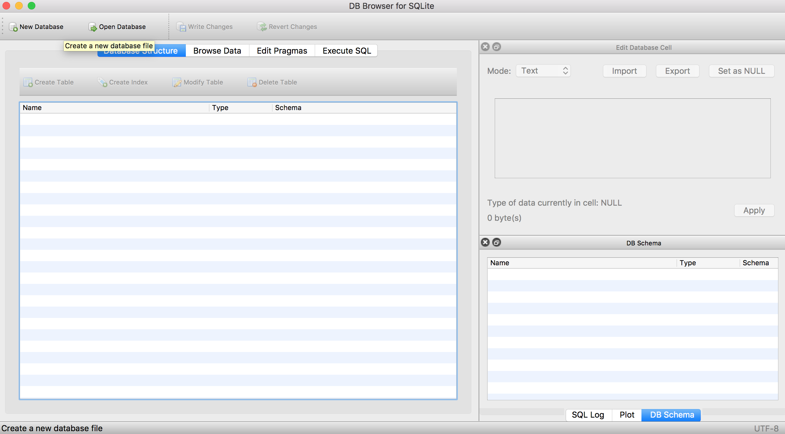
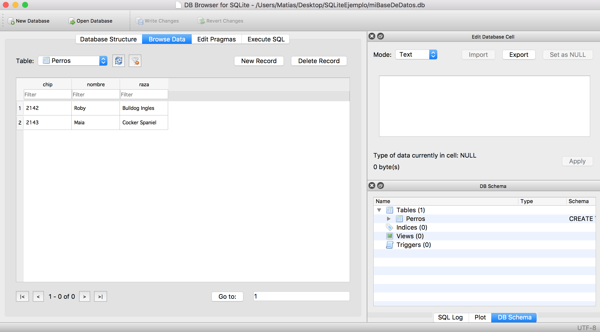
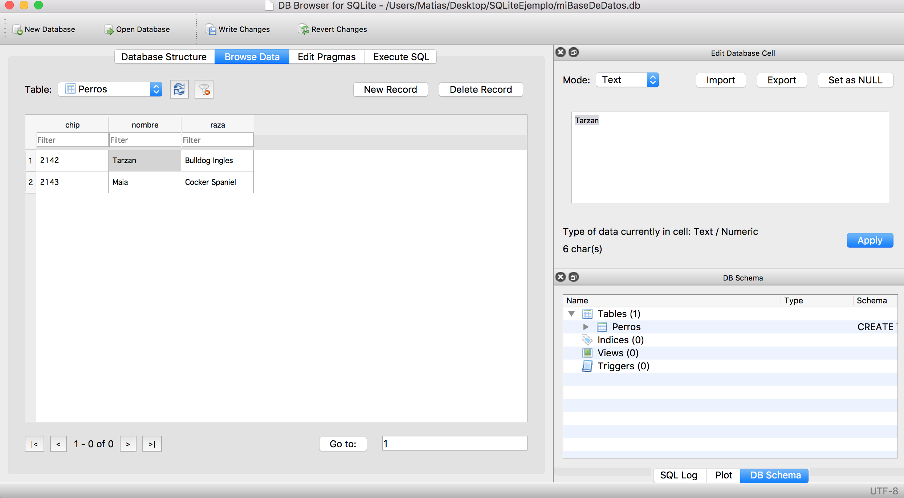
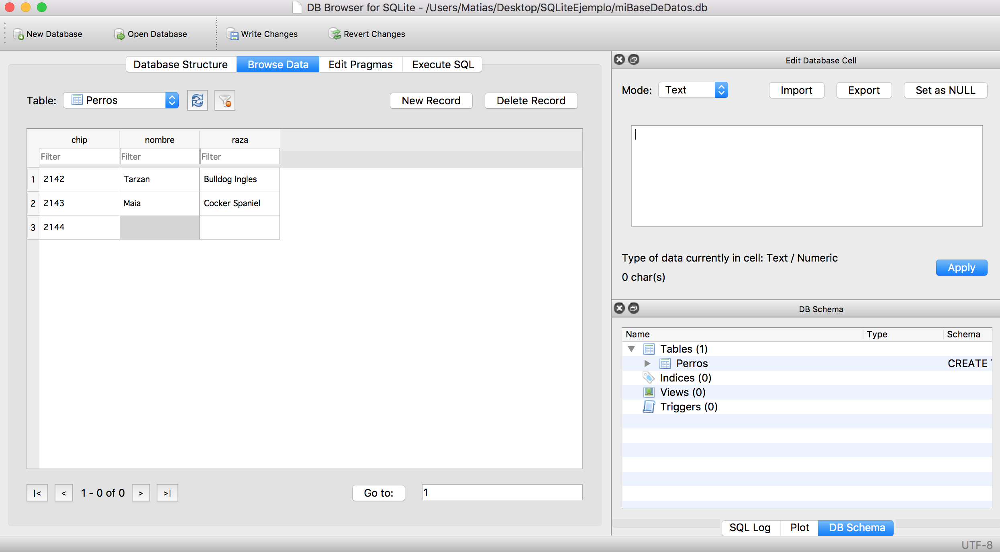
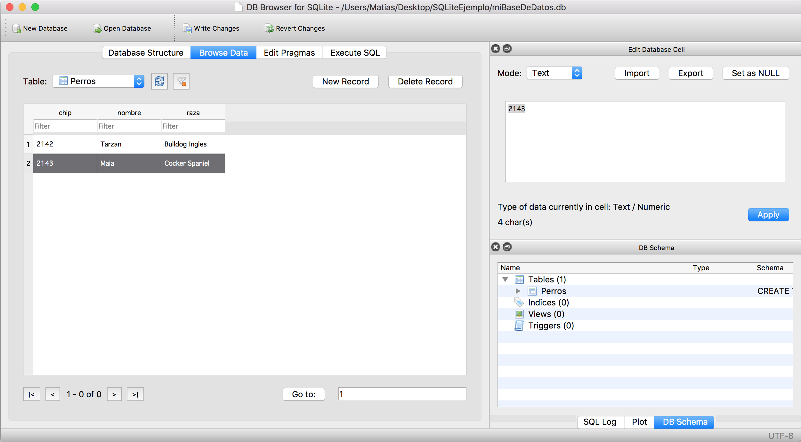

## DBBrowser para SQLite

DB Browser para SQLite es un software open source que nos permite crear, diseñar y editar archivos .db de SQLite.

Así que a continuación iremos a desarrollar una guía de como utilizar este software para explorar la base de datos que creamos anteriormente.

## ¿Que necesitamos para trabajar?

 - [**DBBrowser**](http://sqlitebrowser.org)

Para descargar esta herramienta simplemente basta hacer clic encima del titulo, en la pagina oficial del desarrollador se encuentran todas las versiones tanto para Windows, Mac OS X, como Linux o en caso contrario hacer [click aquí](./download) para ver todos las descargas.

> **Aclaración:** Todas estas herramientas ya se encuentran instaladas en las maquinas del laboratorio que iremos a desarrollar esta guía.

## Comienzo de la guía de trabajo

Antes que nada debemos ejecutar la aplicación, y nos encontraremos con una interfaz similar a la siguiente:

Ahora debemos abrir el archivo que contiene nuestra base de datos, para ellos debemos:
1. Irnos a <kbd>File->Open Database</kbd>.
2. Seleccionar el archivo en nuestro file system y clickear <kbd>Open</kbd>.

Ahora desde la pestaña superior <kbd>Database Structure</kbd> podemos explorar la estructura de nuestra base de datos, es decir ver que tipo de datos almacena cada columna de nuestra tabla y que columnas existen.

Pero nos interesa editar la información que guarda nuestra base de datos para luego ver si esta se ve reflejada en la aplicación que creamos anteriormente.
Para ello debemos dirigirnos a la pestaña <kbd>Browse Data</kbd>.

Deberíamos ver una ventana similar a la anterior, en esta ventana podremos agregar, editar, y borrar filas de nuestra tabla manualmente; a continuación vamos a explicar como realizar cada una de estas acciones.

### Editando filas

Como se puede ver al hacer click sobre el nombre de la fila 1, en la parte izquierda de DBBrowser nos apareció un campo de texto con el valor actual que tiene esta columna, para cambiarlo simplemente debemos escribir el nuevo valor que quiéramos que tome y apretar el botón <kbd>Apply</kbd>.

Para guardar estos cambios que realizamos debemos clickear sobre el botón <kbd>Write Changes</kbd> que se encuentra en la esquina superior izquierda.

### Agregando filas
Para agregar una nueva fila debemos clickear sobre el botón <kbd>New Record</kbd>, donde nos despliega una nueva fila vacía, aquí debemos completar cada una de las columnas de esta fila de la forma que lo hicimos anteriormente editando una fila cualquiera.

Por ultimo igualmente que como cuando editamos una fila debemos clickear el botón <kbd>Write Changes</kbd> para guardar los cambios.

### Borrando filas
Para borrar una nueva fila debemos seleccionar la fila que queremos eliminar, y luego clickear sobre el boton <kbd>Delete Record</kbd> que se encuentra en la esquina superior izquierda.

Al igual que todos los demás casos debemos clickear el botón <kbd>Write Changes</kbd>

## Autoría
**Autor:** Matías Crizul

**E-mail:** crizulm@gmail.com

Si tienes preguntas sobre éste tema, no dudes en mandarme un correo electrónico.

### Referencias

1. http://github.com/crizulm/sqlite3
2. http://sqlitebrowser.org
